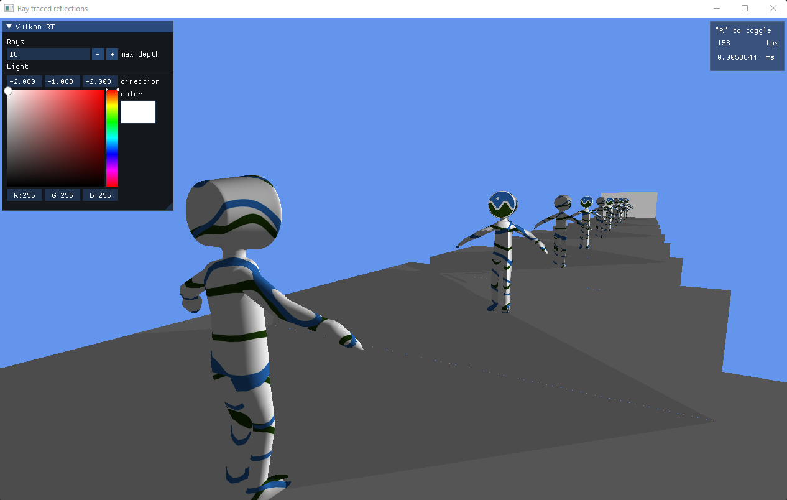

# vulkan-examples-rs

Collection of Vulkan examples that I make to learn stuff in Rust using [ash][ash].



## Examples

You can run one of the following example.

- rt_triangle: Ray-traced triangle with a Vulan setup a bit more involved and using some abstractions.
- rt_shadows: Ray-traced gltf model with simulated sunlight shadow. It has one BLAS with multiple geometries. Light and camera controls with imgui.
- rt_reflections: Ray-traced iterative (not recursive) reflections.

```ps1
# Powershell example (all scripts have a .sh version)

# Compile all glsl shaders to spir-v 1.4
.\scripts\compile_shaders.ps1

# Enable validation layers and set log level to debug
.\scripts\debug.ps1 <example>

# Compiles with --release and set log level to info
.\scripts\run.ps1 <example>
```

## Useful links

- [NVidia tutorial](https://nvpro-samples.github.io/vk_raytracing_tutorial_KHR/)
- [SaschaWillems' Vulkan](https://github.com/SaschaWillems/Vulkan)

[ash]: https://github.com/MaikKlein/ash
